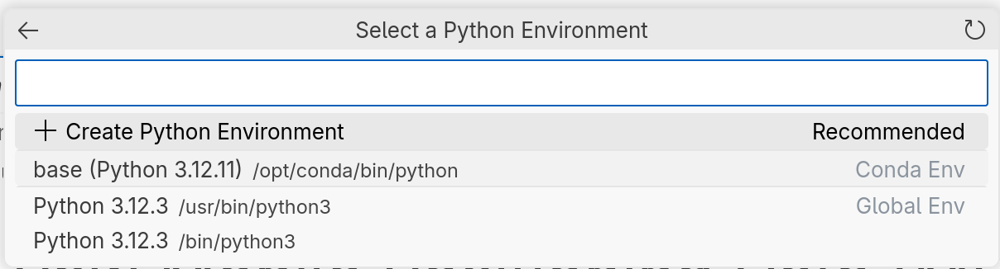

# Documentation for Launching in GitHub Codespaces with Jupyter & PySpark

[GitHub Codespaces](https://github.com/features/codespaces) provides a VS Code development environment in your browser. Codespaces is free for individual use up to 60 hours a month, and is also available for organizations with [pay-as-you-go pricing](https://docs.github.com/en/billing/concepts/product-billing/github-codespaces). This repository contains a [dev container](https://docs.github.com/en/codespaces/setting-up-your-project-for-codespaces/adding-a-dev-container-configuration/introduction-to-dev-containers) configuration facilitating the quick creation of a codespace containing Java, PySpark and all the required Python data science packages.

## Launch a codespace for this repository

You will need to have an existing Github account, otherwise [create one](https://docs.github.com/en/get-started/start-your-journey/creating-an-account-on-github) before proceeding.  
Click the "Open in GitHub Codespaces" badge to create (or resume) a codespace in the default branch. This will launch an in-browser VS Code development environment, which may take a few minutes to configure on first setup.

To run notebooks, remember to select the `base` Python environment (`/opt/conda/bin/python`) since this is where the required Python packages are installed in the dev container e.g.

